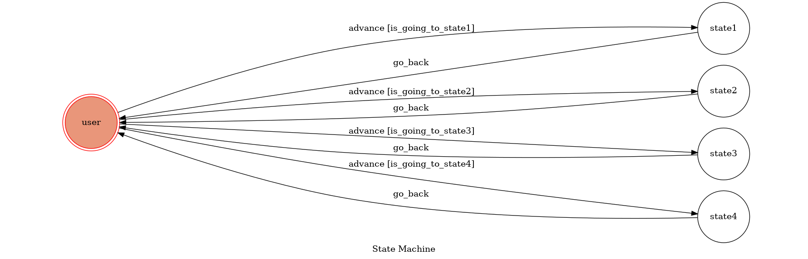

# TOC Project 2019

## How to Start the Chatbot
1. ./ngrok http 5000 (creat a https URL)
2. python3 app.py
3. setting webhook on the website *facebook for developer* (https URL created by ngrok, VERIFY_TOKEN=2325)
4. finish setting

## How to Interact with the Chatbot
* Input: go to state1
	* Reply: I'm entering state1
* Input: go to state2
	* Reply: I'm entering state2
* Input: go to state3
	* Reply: I'm entering state3
* Input: go to state4
	* Reply: Will you join the club?Tap a button to answer.[Two buttons: YES! and NO!]
	* Click "YES!" -> reply "Welcome!"
	* Click "NO!"  -> reply "Why???"
* Input: a photo
	* Reply: Great Photo><

## FSM

##How to Start the Chatbot after push to Heroku
1. open the domain
2. setting webhook on the website *facebook for developer* (https URL = https://chatbot-f74056190.herokuapp.com/, VERIFY_TOKEN=2325)
3. start chatbot
4. see the details when running in view log
